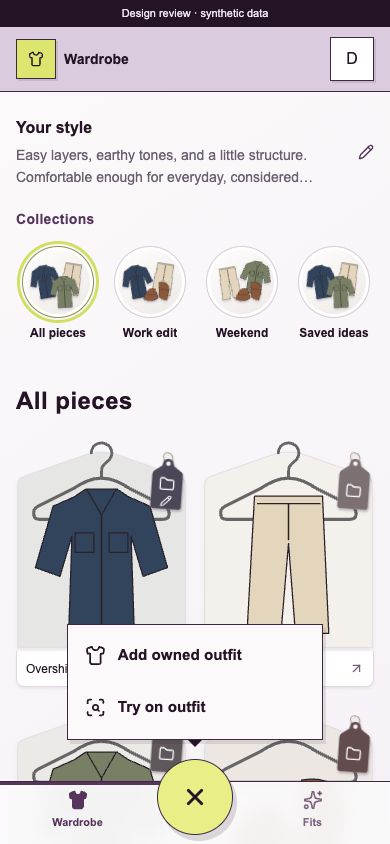
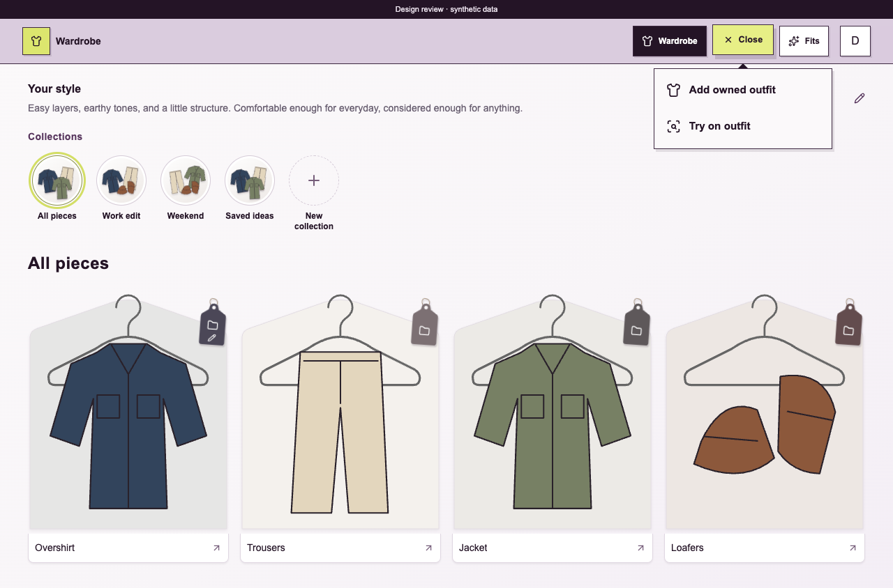

# Add action and app interaction review

[Tracking issue #125](https://github.com/schmitd/wardrobe/issues/125) links the ten findings from the September 26 review. Baseline: `14f1c4c`. This PR implements Add, removes the original-photo switch and removes confirmed unnecessary copy. The five larger follow-ups remain open.

## Design to review

| Phone | Desktop |
| --- | --- |
|  |  |

These are screenshots of the implemented components with synthetic content, not imagegen concepts or private wardrobe photos.

The + becomes × at the same location. A compact menu opens from that trigger, with **Add owned outfit** and **Try on outfit** as equal neutral rows. Citron belongs to the trigger; neither choice is selected. Motion connects opening and closing to that point, and reduced motion removes movement. Escape, outside tap and × dismiss; keyboard arrows move focus. Choosing a row opens the existing picker or native camera with that intent. Scope remains automatic. An in-flight capture disables another Add.

Completed photo preparation has no panel. The image is followed by Labels, Collections and My note. A concise pending state or useful recovery replaces the old internals explanation. **Use original photo** is removed from web and native clients. Source storage, automatic failure fallback and legacy server compatibility remain; opening an item does not initiate paid bulk generation.

## What the user actually asked for

| Direct user guidance | Evidence and successful pattern | How this pass applies it |
| --- | --- | --- |
| Aug 28: reduce feature verticals; combine related features into a cohesive, simple hierarchy | [#60](https://github.com/schmitd/wardrobe/issues/60), [#61](https://github.com/schmitd/wardrobe/issues/61), merged [#68](https://github.com/schmitd/wardrobe/pull/68) | Keep Wardrobe / Fits, one global Add, account in the header. |
| Sep 19: “I really like” shirt-shaped cards and each item’s color accent; fix the photo fit | Direct conversation checked; merged [#98](https://github.com/schmitd/wardrobe/pull/98) | Preserve the silhouette, neutral hanger, physical tag, item accent and contained photos. |
| Sep 22: fit checks can supply actual-wear evidence; absent that, a single “Wore it” button | Direct request and [#105](https://github.com/schmitd/wardrobe/issues/105), [#106](https://github.com/schmitd/wardrobe/issues/106) | Avoid routine confirmation and mechanism copy. Leave evidence semantics to that existing work. |
| Sep 26: move deletion under details, remove duplicate pending UI, contain the note icon | Direct follow-up checked; merged [#114](https://github.com/schmitd/wardrobe/pull/114) | Keep destructive controls contextual; use one visible status per operation. |
| Sep 26, this request: connected Add motion, two equal actions, no default highlight/subtitles/internals explanation/original-photo choice | [#115](https://github.com/schmitd/wardrobe/issues/115)–[#119](https://github.com/schmitd/wardrobe/issues/119) | Implement those explicit corrections across the affected web and native surfaces. |

Supporting implementation evidence is a separate category: [#102](https://github.com/schmitd/wardrobe/pull/102) records approval of the neutral hanger, shaped tag, compact style notes, collection ensembles and whole-card details. [#59](https://github.com/schmitd/wardrobe/pull/59) and [#78](https://github.com/schmitd/wardrobe/pull/78) removed routine routing/success confirmations. Keep those specific patterns. A merged PR does not make every assistant-authored paragraph or control a user preference. In particular, #103’s original-photo controls and the old roadmap’s scope confirmation are superseded.

## Unified choices and remaining issues

| Problem | Selected treatment | Status |
| --- | --- | --- |
| [#115 Add menu](https://github.com/schmitd/wardrobe/issues/115) | Anchored motion, +/×, two equal actions | Implemented here |
| [#116 Photo preparation](https://github.com/schmitd/wardrobe/issues/116) | Automatic image; concise status/recovery only | Implemented here |
| [#117 Capture feedback](https://github.com/schmitd/wardrobe/issues/117) | One short status/result, internal stages stay internal | Implemented here |
| [#118 Routine copy](https://github.com/schmitd/wardrobe/issues/118) | Title, fields, actions; remove repeated helper paragraphs | Implemented on the audited surfaces |
| [#119 Onboarding](https://github.com/schmitd/wardrobe/issues/119) | One invitation, one photo action, useful framing instruction | Implemented here |
| [#120 Try-on](https://github.com/schmitd/wardrobe/issues/120) | Photo, verdict, advice and owned-item images; remove scorecard | Redundant copy removed; result layout remains |
| [#121 Recognition](https://github.com/schmitd/wardrobe/issues/121) | Quiet resolved pieces; visual correction only when needed | Explainer removed; correction layout remains |
| [#122 Diary](https://github.com/schmitd/wardrobe/issues/122) | Contained outfit photos with short context; details on demand | Calendar subtitle removed; photo/detail layout remains |
| [#123 Removal](https://github.com/schmitd/wardrobe/issues/123) | No default dislike; optional neutral reason with correct graph semantics | Separate behavior change |
| [#124 Native consistency](https://github.com/schmitd/wardrobe/issues/124) | Shared vocabulary and hierarchy, native controls | Add/preview/copy aligned; larger hierarchy remains |

User-written notes, useful styling advice, field labels, accessible names, permissions, destructive consequences and real limitations are meaningful content. This is not a blanket ban on text. Existing #105/#106/#108 and drafts #109/#110 cover evidence, history, reminders and image sharing; this review links them instead of duplicating their implementation.

## Evidence and validation

The live production browser was signed out; the supplied screenshots establish the authenticated reported defects. The rest of the web review uses real components and styles with synthetic external boundaries, plus current source. The iOS Simulator showed the older native Fits/Plans structure. No private photos or account data were added to GitHub.

- Workspace tests: 141 web and 27 native tests pass, plus package checks.
- Type checking and lint pass; three existing web lint warnings remain. The web production build passes using the existing local public build configuration; this is compilation validation, not production authentication verification.
- Five browser journeys pass using installed Chrome: item photo preparation, planner history, multilingual week editing, delayed try-on intent, and the new menu behavior.
- Menu checked at 320, 390, 768 and 1280px: anchor alignment, no overflow, equal unfocused actions, arrows, Escape/focus return, outside dismissal, picker cancellation and reopen. Reduced motion checked at 320px.
- Real Chrome interaction independently inspected the menu on desktop and phone widths. Screenshots above come from the reproducible browser journey.
- iOS and Android Metro exports pass. The actual native Add component was also exercised in an isolated Expo Go fixture on an iPhone 17 Pro simulator: equal actions, anchor placement, close/reopen and both intent callbacks. Full authenticated camera flow, Android device and screen-reader validation remain release checks.

Run the synthetic review with:

```sh
bun install --frozen-lockfile
PROBE_PORT=4186 bun run apps/web/validation/browser/server.ts
# http://127.0.0.1:4186/
PLAYWRIGHT_CHANNEL=chrome PROBE_PORT=4187 bun run validate browser
```

No merge, production deployment, provider configuration change or native release is part of this draft.
