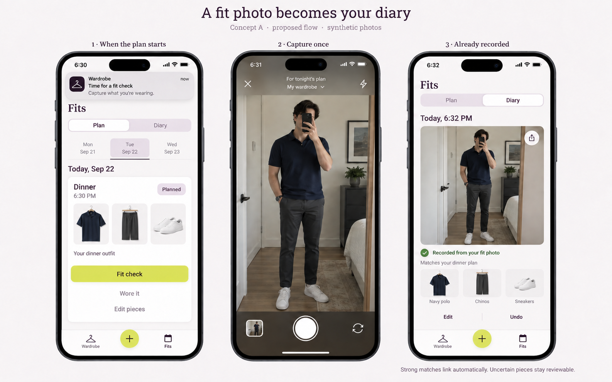
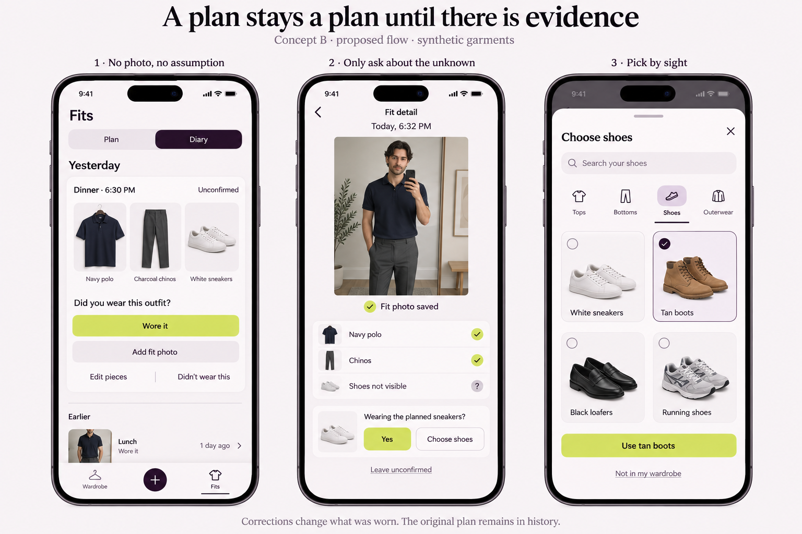

# Fit photos as evidence of wear

Status: proposed for David's review, 2026-09-22. Design and architecture only; implementation, production graph changes, and release are not authorized by this artifact.

Tracking: [user story #105](https://github.com/schmitd/wardrobe/issues/105), [ontology #106](https://github.com/schmitd/wardrobe/issues/106), [notifications #107](https://github.com/schmitd/wardrobe/issues/107), [image sharing #108](https://github.com/schmitd/wardrobe/issues/108). Existing [actual-worn editing #88](https://github.com/schmitd/wardrobe/issues/88), [planning #65](https://github.com/schmitd/wardrobe/issues/65), [matcher benchmark #66](https://github.com/schmitd/wardrobe/issues/66), [capture intent #93](https://github.com/schmitd/wardrobe/issues/93), and [style refresh #95](https://github.com/schmitd/wardrobe/issues/95) retain their history and release gates.

## The user story

As someone who plans outfits and takes fit photos, I want a corresponding fit check to record what I actually wore, so I do not maintain a second wear log. When I do not have a photo, I can affirm the plan with one **Wore it** action. Without either signal, the plan stays **Unconfirmed**, however much time passes.

A plan expresses intent. A daily fit photo records an observation. A manual affirmation records what the user says they wore. Recognition connects supported garment identities; it does not certify an entire planned outfit just because some items look similar. Notifications help collect evidence but are never evidence themselves.

The reported `/fits` screenshots show long analysis text competing with the outfit and a replacement select filled with paragraph descriptions. This proposal replaces that with photo-led recognition and focused visual correction. It is a hypothesis from direct user feedback, not a measured prevalence claim.

## Review renders

### A — Planned event → fit photo → Diary

At an accepted timed event's start, a generic reminder opens the existing capture flow with the occurrence context. Strong matching evidence records the actual outfit and updates Diary without a success confirmation screen. The plan remains in history; the Diary shows provenance and an editable result.

### B — No evidence, partial evidence, or changed pieces

Yesterday's unconfirmed plan has a single primary **Wore it** action. A photo with shoes out of frame saves the visible evidence first; one inline question can resolve the shoes. **Choose shoes** opens a visual, searchable, category-focused sheet. **Leave unconfirmed** dismisses the question while retaining the partial fit.

These built-in imagegen renders use synthetic garments and people. [Prompts](imagegen-prompts.md) are included. They establish hierarchy and state transitions, not pixel-perfect system controls. Final UI must reuse actual components and meet measured contrast, focus, dynamic-type and touch-target requirements. Generated garment cards simplify the current rack silhouette; implementation must retain the existing shirt-shaped cards, neutral closed hangers, tags and photo-derived accents. Native controls follow each platform; the web must not copy a painted iOS screen.

## Interaction contract

| State | Main content | Primary action | Secondary actions / result |
| --- | --- | --- | --- |
| Future accepted plan | Time, short context, contained owned-piece images | Edit plan | No future wear affirmation; capture can be a try-on but cannot certify future wear |
| Plan due/current | Same compact visual outfit | Fit check | Wore it, Edit pieces; contextual action reuses global capture |
| Past plan, no evidence | Neutral Unconfirmed with short date/context | Wore it | Add fit photo, Edit pieces, Didn't wear this |
| Full strong photo evidence | Saved photo, short garment names | No completion button | Recorded from your fit photo; Edit / Undo; Share fit |
| Partial/uncertain evidence | Saved photo and supported matches | Resolve the one unknown, if desired | Leave unconfirmed; do not restart capture or block saved evidence |
| Different actual outfit | Actual photo/pieces | No redundant confirmation when evidence is sufficient | Worn differently; original plan available through details |
| Manual affirmation | Date and affirmed pieces; no fake photo | No completion button | Recorded by you; Edit / Undo / Add fit photo |
| Explicit didn't-wear response | Plan history with neutral Didn't wear this | Edit response | No inference that a garment or style was disliked |

Keep Fits → Plan / Diary and Wardrobe / global Add / Fits. No new top-level Evidence or Notifications destination. Settings live behind the account affordance. A contextual fit-check button is an entry into the existing capture controller, not a competing capture subsystem.

**Wore it** submits the displayed occurrence/revision and item snapshot. A late answer defaults to that plan's local date/time, visibly editable. A stale plan reloads before confirmation instead of silently affirming another set of items. Undo is immediately available and correction remains possible later from detail. Editing items before affirmation creates an actual-item draft; it must not overwrite the original plan.

Photos from the camera carry capture time and timezone. Library photos with uncertain timing need one concise date confirmation; an EXIF timestamp is a suggestion, not trusted evidence of event attendance. A notification's plan ID is navigation context, not proof that an old uploaded photo was taken at that event. A day-only record must never invent a midnight wear instant.

When the user selects **Not in my wardrobe**, record an unresolved/external garment observation if needed. Do not automatically create ownership. Try-on and shopping-candidate captures remain evaluative, even if they resemble a planned outfit. A fit can exist independently of a plan.

## Automatic association policy

1. Preserve daily-fit versus just-trying intent and route scope through capture. Resolve primary-subject garments using the existing localization/identity pipeline.
2. Use the existing final identity decision, including its visual comparison fallback, rather than a second matching model. Current `garmentIdentity.ts` uses embedding score ≥0.92 plus a ≥0.06 margin for its first automatic path, and ≥0.72 for review; direct visual comparison can change the result. These are existing policy values, not newly validated whole-outfit accuracy guarantees.
3. Build an actual occurrence from supported observations even without a plan. An unresolved item stays an observation rather than a guessed wardrobe identity.
4. Find a unique compatible accepted plan occurrence using explicit capture context, actual time precision, revision and garment coverage. Proposed automatic window for a timed plan is event start minus 30 minutes through event end (or start plus 60 minutes if no end), constrained by trusted capture timing. This is a reviewable default, not proof of attendance. Date-only plans use the local date and require uniqueness. When more than one plan is compatible, offer a short context choice rather than guessing.
5. Confirm **as planned** only if all planned items are supported by current photo/manual evidence and no conflicting or unresolved actual item remains. Not seeing a garment does not prove it was absent. A detected but unresolved extra piece prevents whole-plan confirmation, while known item sightings are still useful.
6. If the actual outfit differs, keep the planned snapshot and actual snapshot separately. An explicit plan context can associate the occurrence; without it, insufficient overlap or ambiguous timing needs a context choice. Never label a different outfit as worn exactly as planned.

An earlier fit that does not correspond to an evening plan cannot confirm it. Multiple wear occurrences in one day are valid. Multiple photos of one occurrence and a later photo of a manually affirmed occurrence attach evidence to the existing record using explicit linkage/unique association; do not deduplicate only by date or equal item sets.

## Review decisions

- Recommended: keep manual **Wore it** on the plan/Diary, with no direct background wear mutation from a lock-screen action. Push opens the current state.
- Recommended: ask only about uncertain pieces/time/plan context; users can leave a partial record.
- Recommended: past plans remain quietly unconfirmed indefinitely, with no follow-up push or inferred negative preference.
- Multiple-event reminder cap, midday time, quiet hours and untimed-plan handling remain proposed in #107; no answer has been treated as approval.
- The generated boards intentionally avoid a full manual outfit form. Review the hierarchy here or comment in #105/#106 before implementation.

## Implementation slices after review

1. Add authoritative occurrence/evidence records, revision checks and compatibility projections. See [architecture](architecture.md). Cover transition, identity, deletion, retry and time semantics with meaningful invariant tests.
2. Integrate capture and manual confirmation into the shared backend; preserve client intent/time. Provide a bounded Diary read model containing the actual UI fields.
3. Replace the descriptions-as-options control with the focused visual picker and exception-only correction on web/iOS/Android.
4. Validate Zep v2 using synthetic graphs, then shadow projection and guarded migration. Wire #95 refresh only to committed domain changes with typed evidence.
5. Integrate the independently reviewed #107 notification policy and #108 image export. Each implementation PR stays draft for review.

Release checks: real browser and physical native camera/library → analysis → Diary flows, current/past manual wear, hidden/ambiguous garments, changed outfit, backdated photo, repeated requests, two same-day outfits, undo and offline recovery. Keyboard, screen reader, large text, small screens, focus restoration and photo masking are mandatory. These design images do not count as those checks.

Measure reconciliation steps, automatic-association correction rate, unresolved-piece completion and opt-out using bounded outcome categories. No images, outfit descriptions, calendar text, filenames, raw garment IDs or recipient details in analytics. Keep user-submitted screenshots out of the public repository.
