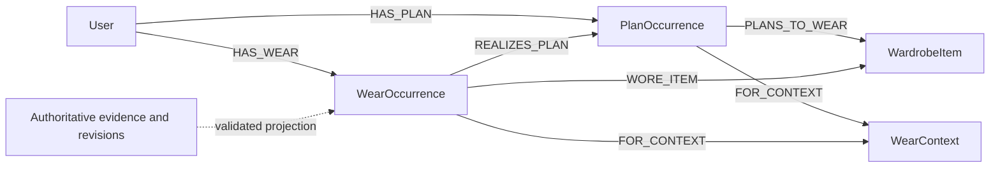

# Planned intent and actual wear: domain and graph design

Proposed, 2026-09-22. Related [#105](https://github.com/schmitd/wardrobe/issues/105) and [#106](https://github.com/schmitd/wardrobe/issues/106). No schema, ontology or production graph is changed by this document.

## Current code evidence

Baseline: main `24a30cc` on 2026-09-22. Source was read through Confect wrappers to the underlying legacy implementations; this is not a live user-graph audit.

| Source | Observed contract / implication |
| --- | --- |
| [outfitSuggestions table](../../../apps/web/confect/tables/outfitSuggestions.ts) and [planning mutation](../../../apps/web/confect/legacy/planning.ts) | One date, mutable `itemIds`, suggested/planned/worn/dismissed. No event occurrence ID, wear evidence, original-plan snapshot or explicit wear time. `worn` requires `planned`; terminal worn rows reject updates. |
| [fitChecks](../../../apps/web/confect/tables/fitChecks.ts), [fitCheckItems](../../../apps/web/confect/tables/fitCheckItems.ts), [record/resolve implementation](../../../apps/web/confect/legacy/fitChecks.ts) | Capture type, storage, creation/update times, matched/unresolved item sources and separate observations exist. No explicit plan occurrence link or captured-versus-worn timestamps. |
| [garmentIdentity](../../../apps/web/src/server/garmentIdentity.ts), [fitPhotoAnalysis](../../../apps/web/src/server/inference/fitPhotoAnalysis.ts), [capture workflow](../../../apps/web/src/server/workflows/wardrobe.ts) | Localization, match confidence/margin, direct visual disambiguation and unresolved observations already exist. Reuse them; identity confidence alone is not whole-outfit coverage or event-time confidence. |
| [zepOntology](../../../apps/web/confect/legacy/zepOntology.ts) | `WORN_FOR` explicitly covers worn, tried-on, planned, recommended and rejected use; `WearContext` mixes intent/observation/evaluation. |
| [Zep writer/search](../../../apps/web/confect/legacy/zep.ts) | Daily fits and try-ons write `WORN_FOR`; unresolved observations skip direct triples but remain in the episode payload. `addGarmentIdentityResolutionMemory` describes daily wear without taking the original fit type/time. `searchWardrobeStyleMemory` returns fact/relation/relevance without occurrence/revision/time/provenance for authoritative validation. |

The last point must be handled end to end: restricting direct triples is insufficient if a generic episode extractor can independently infer the same false assertion. Review source payloads, extraction instructions, direct facts, summaries and every retrieval consumer together.

## Domain model (Convex is authoritative)

Proposed names describe responsibilities; final schemas should fit Confect/Effect conventions. User ownership is checked on every relationship. Indexed queries are bounded; no per-user full scans on a notification or Diary request.

| Record | Identity and minimum fields | Meaning |
| --- | --- | --- |
| Plan occurrence | Stable user-scoped ID; source suggestion; active revision; local date, IANA zone, optional start/end UTC; optional minimal calendar recurrence key; lifecycle scheduled/cancelled | One accepted outfit intention for one occasion. A suggestion alone is not a plan. |
| Plan revision | Occurrence ID, monotonically increasing revision, immutable proposed item IDs/snapshots, context reference, recorded time, supersedes revision | Preserve what was intended at each edit. Evidence points to the revision it confirms. |
| Wear occurrence | Stable ID, active revision, actual local date/zone, optional instant/interval and precision, optional associated plan occurrence/revision | One real wear observation/affirmation, independent of whether a plan existed. |
| Wear revision | Actual item assertions, unresolved observation references, supported coverage, active/retracted state, superseded revision, reason kind, recorded time | Current corrected view, preserving prior claims. Unknown garments are not invented owned items. |
| Evidence | Stable ID/idempotency key, user, occurrence, source fit/capture or manual action, kind, supported item IDs, source time/precision, recorded time, source revision, active/retracted, policy version | Why an item/time/context assertion is supported. Photo, manual whole-plan affirmation and manual item correction may coexist. |
| Outbox / projection ledger | Domain event ID, aggregate/revision, ontology version, attempts, lease, state; returned Zep episode/edge/node UUIDs | Durable delivery and reconciliation; never a source of product truth. |

Store `capturedAt`, `occurredAt`/local date, `recordedAt`, and time precision separately. With date-only evidence, preserve a local date and zone without fabricating an instant. Calendar start time is intention, not an observed duration of wear. Retain only the minimum consented calendar identifiers/timing needed for scheduling and reconciliation; do not ingest raw event descriptions or attendee lists.

`PlanOutcome` is derived: unconfirmed, confirmed_as_planned, worn_differently, explicitly_not_worn. Cancellation is a plan lifecycle operation; a push dismissal is neither. `WearCoverage` is separate: partial versus supported. A partial wear occurrence may be associated with a still-unconfirmed plan.

### Transitions and precedence

| Input | Domain effect | Must not happen |
| --- | --- | --- |
| Accept suggestion | Create stable plan occurrence and revision | No wear assertion |
| Event passes / no answer | No write required; UI derives past + unconfirmed | No skipped/worn state, daily episodes or inferred dislike |
| Daily photo, supported identities | Create/update wear occurrence and evidence; associate if uniquely supported | No identity from the planned list alone |
| Wore it | Atomically affirm displayed plan revision/items and occurrence time | No overwrite of original plan; no empty/foreign/stale item set |
| Photo after manual affirmation | Attach compatible evidence to same occurrence | No duplicate wear count |
| Item correction | New wear revision and evidence; retract superseded affected assertion | No change to unrelated dates or intended items |
| Undo manual affirmation | Retract that evidence; recompute supported result | Do not erase still-active photo evidence |
| Delete source photo | Revoke its support and remove stored image under retention policy | Do not erase independently affirmed wear; do not keep photo-only certainty |
| Didn't wear this | Explicit scoped response against the plan revision; resolve conflict in app if strong evidence exists | No global dislike and no silent erasure of contradictory evidence |
| Plan edit after wear | New plan revision; retain evidence association to old revision | No retroactive rewrite of the historical intention |
| Account deletion | Tombstone user, revoke jobs, delete all domain/media/projection data per deletion policy | No retry or late provider result can recreate the user graph |

Idempotency is scoped to user + client/domain action and retained durably. A repeated mutation returns its result. Two concurrent affirmations of one plan use revision/CAS checks and a single canonical associated occurrence; different real occurrences sharing date/items remain distinct. Conflicting edits require fresh state. Same-day/time similarity alone is not a deduplication key.

## Small, typed graph projection

Reuse `User`, `WardrobeItem`, `WearContext` and the existing style vocabulary; add just `PlanOccurrence` and `WearOccurrence` as graph entities. Evidence/revisions are application records and source episodes/attributes, not a new entity for every photo crop, retry, status, date, confidence or notification.

| Relation | Allowed endpoints | Invariant |
| --- | --- | --- |
| HAS_PLAN | User → PlanOccurrence | Accepted intent, regardless of subsequent wear |
| PLANS_TO_WEAR | PlanOccurrence → WardrobeItem | Planned membership for an identified revision; never evidence of wear |
| HAS_WEAR | User → WearOccurrence | At least one active authoritative wear assertion; coverage can be partial |
| WORE_ITEM | WearOccurrence → WardrobeItem | Specific supported actual item; active evidence IDs and revision required |
| REALIZES_PLAN | WearOccurrence → PlanOccurrence | Supported association; relation attribute outcome distinguishes partial/as_planned/different |
| FOR_CONTEXT | Either occurrence → WearContext | Descriptive context only; no assertion of attendance or wear by itself |
| TRIED_IN | WardrobeItem or CandidateItem → WearContext | Try-on evaluation only; isolated from wear reads |

Use exact stable application IDs in canonical names plus typed `source_ref` properties, and store returned Zep UUID mappings. Names and timestamps alone do not guarantee deduplication. Episode extraction is best-effort; assert required endpoint types and inspect the resulting graph. Do not add new unconstrained style-to-style relation types for every user phrase.

Every v2 assertion carries `ontology_version`, `aggregate_id`, `aggregate_revision`, `source_ref`, evidence kind/refs, occurrence time/precision and recorded time where supported by the installed SDK. Keep private source data in the authorized user graph; no photos, base64 images, temporary storage URLs, calendar titles or notification details in these new episodes.

A plan episode says accepted intention explicitly and contains only intent relations. A wear episode contains only supported actual items, with unresolved observations omitted from extractable identity assertions or explicitly non-asserting. A correction identifies the occurrence, superseded revision and affected assertion. Do not rely on adding a broad sentence such as “the user didn't wear the blue shirt” to invalidate exactly the intended date.

### Temporal semantics and historical truth

Zep's [graph creation documentation](https://help.getzep.com/how-graph-creation-works) describes temporal bounds, best-effort entity resolution and contradiction-driven invalidation. That is useful for memory, but it is not a transactional application state machine. Preserve both event time and recording/projection time and verify how the installed Cloud SDK represents them. Do not equate edge invalidation with arbitrary node deletion or assume all historical nodes automatically disappear.

Example: a Monday dinner plan contains sneakers. On Thursday the user affirms that Monday's actual shoes were boots. Monday remains the occurrence date; Thursday is when the new evidence was recorded. The sneakers intention is still true as historical intent. Only the Monday actual-shoes assertion is corrected. Another Saturday sneakers occurrence is unaffected.

An edge whose real-world validity interval ended can still be true historical wear. Conversely, a superseded assertion can have a plausible date but be an incorrect claim. Therefore `invalid_at IS NULL` alone is not a wear-history filter, and searching all historical edges is not a current-truth filter. Query event-time overlap and validate active authoritative revision/evidence separately. An “as known on Tuesday” audit additionally restricts evidence by recorded-time/retraction history.

Use supported explicit correction/invalidation APIs only after verifying them against the pinned Cloud SDK. If targeted invalidation cannot be demonstrated, the authoritative application revision must gate all reads and v2 must stay in shadow mode. Do not invent a Cloud operation from a Graphiti example or trust an extractor to replace only one edge.

## Retrieval, synchronization and migration

1. Domain mutation writes records and an outbox event in one transaction. Capture/manual result succeeds independently of Zep availability. Provider work runs in actions with revision guards and bounded retries.
2. Partition ordered projection by user/aggregate. Before I/O and before acknowledging results, check deletion epoch/current revision. Store result UUIDs and episode IDs. A stale in-flight external write can still finish: enqueue reconciliation for newest truth and reject its old revision in reads immediately.
3. Deliver each logical revision once where possible. After an ambiguous provider response, use the ledger/returned references and reconciliation; do not assume provider idempotency. Quarantine duplicate/missing results. Bound queue pages, retries and dead-letter recovery.
4. Retrieve v2 typed candidates with occurrence/revision/provenance. Use [Zep search filters](https://help.getzep.com/searching-the-graph) where the pinned SDK supports them, then validate against Convex. Legacy writers/readers and summaries must not provide an unfiltered backdoor to wear claims. Exclude invalid or unresolvable candidates and use bounded authoritative history if projection is stale.
5. Style refresh and repetition avoidance consume active actual wear only. Intent may influence future plans but cannot contribute observed-wear frequency. Try-on feedback may contribute explicitly typed evaluative preferences, never worn recency. A user's “didn't wear” is not a dislike unless they say so.

Migration is additive and feature-gated. Do not repurpose legacy `WORN_FOR` facts. Existing worn rows with explicit affirmative provenance can seed manual evidence; when original plan items/time are unavailable, preserve a legacy source/precision marker and do not reconstruct an invented original intention. Legacy fits can seed only what their persisted type/items support; creation time stays recorded time unless capture time is known. Existing unconfirmed planned rows remain plans.

Start with a synthetic graph and v2 shadow projection. Use bounded resumable backfill with user/row cursors, deterministic action keys, per-user comparison reports and failure quarantine. Ensure a user already migrated cannot receive new legacy broad wear writes. Change ontology only for targeted test/rollout users through the project's supported configuration, never an unreviewed project-wide reset. Rollback disables v2 projection/read flags without deleting authoritative history; keep old non-v2 consumers from making false wear inferences. Account deletion is a separate actual deletion workflow, not history-preserving correction.

## Required feasibility evidence before implementation rollout

- Synthetic Cloud graph: planned A then actual B; same item worn Monday and Saturday; Thursday correction to Monday; date-only evidence; future plan; ambiguous match; try-on resolution. Verify exact returned node labels/relations/UUIDs and both current and as-of answers.
- Prove repeated episodes and two concurrent/out-of-order revisions do not duplicate the application's occurrences or expose stale wear through graph summaries, style-bio retrieval, direct triples or generic search.
- Prove photo deletion with and without independent manual support; undo; plan reschedule; item archival preserving authorized history; account deletion while projection is in flight.
- Compare authoritative expected results to graph reads for “What did I wear Monday?”, “What did I plan Monday?”, “What have I actually worn recently?” and “What did we believe on Tuesday?”. Keep evidence fixtures synthetic.
- Validate installed SDK support for ontology targeting, relation labels, attributes, returned UUIDs, temporal reference time, filtered retrieval, direct assertion correction and deletion. Record unsupported operations as blockers; the design does not claim these probes ran.

This keeps the graph tractable: nodes grow with garments and real plan/wear occurrences; revision/evidence volume stays in domain records and episodes. The absence of a signal does not create daily graph churn.
