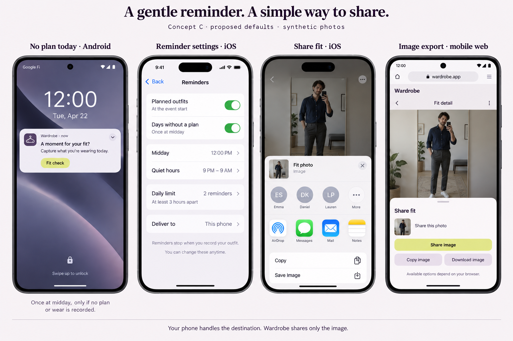

# Fit reminders and image sharing

Proposed for review, 2026-09-22. Documentation and imagegen concepts only. No provider credentials, notification sends, native dependency changes, public photo hosting, deployment or user-data migration are part of this PR.

Tracking: [notification foundation #107](https://github.com/schmitd/wardrobe/issues/107), [share fit #108](https://github.com/schmitd/wardrobe/issues/108). Notification eligibility depends on [fit evidence #105](https://github.com/schmitd/wardrobe/issues/105) and the authoritative model discussed in [ontology #106](https://github.com/schmitd/wardrobe/issues/106), but never on a Zep query at send time. Sharing can be implemented independently after review.

The image was made with built-in imagegen using [this prompt](imagegen-prompts.md). People, garments and system share suggestions are synthetic. Native share targets and browser capabilities vary; the render is illustrative, not a device test. The address shown by imagegen is illustrative and does not designate a new deployment. Settings are proposed defaults, not approved values.

## Discussion direction

- Timed accepted plan: invite a fit photo when the event starts; cancel the reminder when the corresponding capture or wear has been recorded.
- No accepted plan that local day: one reminder at noon if no fit/wear has been recorded. A saved partial daily fit counts as having answered the capture prompt; unresolved pieces remain an in-app question.
- Past unconfirmed plan: leave a quiet **Wore it** affordance in Diary. No repeated push demanding an answer.
- Proposed cadence for multiple events: at most two reminders per local day, at least three hours apart, quiet hours 9 PM–9 AM. David's cadence question is still open; no non-response is treated as approval.
- Share fit: hand the image to the operating system. No contact permission, social destination inside Wardrobe or public link.

Read the [notification architecture](notification-architecture.md) for conditions, time rules, delivery semantics and rollout gates. Read [image sharing](share-fit.md) for platform adapters and failure states.

## Existing constraints

Main `24a30cc` contains Expo SDK 57 and existing camera, filesystem and routing primitives, but [mobile package.json](../../../apps/mobile/package.json) does not list `expo-notifications`, `expo-sharing` or `expo-clipboard`. Source search found no existing push-token registration, Web Push service worker, or image-share adapter in the app code. Permission/notification analytics capture is currently disabled in [analytics.ts](../../../apps/mobile/src/analytics.ts). This source audit does not establish the state of external APNs/FCM credentials or installed binaries.

The accepted-outfit table is day-based and lacks a stable calendar occurrence/start-time association. Event-start reminders need the occurrence/timing model and a reliable, explicitly consented background calendar synchronization contract. Existing on-demand calendar planning is not proof of background freshness. Link work to [#65](https://github.com/schmitd/wardrobe/issues/65), [#89](https://github.com/schmitd/wardrobe/issues/89) and [#90](https://github.com/schmitd/wardrobe/issues/90).

Native push/share features may require a compatible new binary plus signing/provider setup; this PR does not claim they can ship as an OTA update. Web Push needs its own capability-tested adapter. No release cost/quota or account readiness has been rechecked in this design task.

## Review and implementation order

1. Agree on notification catalog/defaults and sharing interaction here or in #107/#108.
2. Implement preference/installation records, authoritative policy function, transactional intent/attempt ledger and cancellation hooks, with synthetic time/race tests.
3. Integrate native permission/token registration and deep links, then Expo sending/receipts; separately implement Web Push from the same policy and account budget. Require compatible device builds.
4. Implement image export and platform share/copy/download adapters independently.
5. Verify real iOS/Android and supported web behavior, consent and masking before enabling delivery. Keep implementation PRs draft for review.

No subscriptions, messages to contacts, or push notifications have been created by this proposal.
