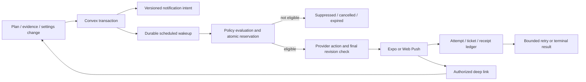

# Notification policy and delivery architecture

Proposed foundation for [#107](https://github.com/schmitd/wardrobe/issues/107). Product decisions are reviewable configuration; platform transports do not decide when the user needs a reminder.

## Catalog and proposed defaults

Consent is required for each enabled notification category and at the operating-system/browser level. Explain the benefit in context, then request permission after a user gesture. Do not request permission on first launch or every denial. Settings expose category toggles, midday time, quiet hours, daily cap, timezone and delivery device; native permission state is reflected honestly.

| Kind | Trigger and local timing | Required conditions | Frequency / expiry | Tap |
| --- | --- | --- | --- | --- |
| `planned_fit_due` | Start of an accepted timed outfit occurrence | Current active plan revision, reliable event time, no corresponding saved/in-progress capture or active wear affirmation | Once per occurrence; expire at min(start + 60 min, end), shared cap/cooldown/quiet hours | Open existing capture with occurrence context, then validate current state |
| `daily_fit_due` | 12:00 in selected IANA zone; user configurable | No active accepted plan anywhere on that local date; no saved daily fit or manual wear on that date; no active capture | Once per local date, expire 2 hours after chosen midday time; shared controls | Open existing daily-fit capture |
| `untimed_plan_fit_due` | Noon in the selected IANA zone | Accepted all-day/date-only plan, no corresponding capture/evidence | Accepted 2026-09-22; replace any daily opportunity, never midnight | Open relevant plan/capture |
| Past-plan follow-up | No push | Past unconfirmed plan | Quiet in-app action indefinitely | Wore it / add photo / edit |
| Share, suggestion, try-on, graph update | No push in initial catalog | Separate issue must justify adding a kind | No default sends | — |

An accepted plan later tonight suppresses the generic noon reminder. A bare calendar event, discarded suggestion or cancelled outfit does not count as an active outfit plan. Untimed/all-day accepted plans get one noon opportunity instead of the generic no-plan reminder. David accepted this behavior on 2026-09-22.

A recorded morning fit suppresses the generic daily prompt, not a separate evening occurrence's prompt. A partial photo of the evening outfit suppresses another request to take that same photo; the plan can remain unconfirmed while the inline unknown-item question is available. A try-on does not count as a daily wear record. “Didn't wear this” resolves that occurrence's reminder without generating a negative style preference. Notification open, dismiss and delivery receipt never alter wear state.

Account-level controls: cap 2 reminders per local day, accepted by David on 2026-09-22; retain the proposed minimum 3-hour spacing, with quiet hours 21:00–09:00 as the working default. Event-start reminders that collide with quiet hours/cooldown are skipped, not delivered later out of context. Earliest due event wins a tie, then stable occurrence ID; others record a suppression reason. The cap is settled. Other settings remain working defaults rather than blanket approval of every architecture choice. The once-per-day midday requirement is fixed; caps and timing are not hard-coded into screens.

If a capture is in progress, defer evaluation briefly within the existing expiry (proposed 10 minutes). A successful/partial save suppresses; an abandoned/failed capture can leave the original opportunity eligible. No reminder is sent after its original expiry. Saving a fit does not reset the budget to permit an extra reminder.

## Authoritative scheduling



Use the existing Convex backend rather than introducing a separate scheduler service. [Convex scheduling](https://docs.convex.dev/scheduling/scheduled-functions) supports durable wakeups and transactional scheduling from mutations. External I/O runs in actions; action failures need explicit recovery. Cancelling a job does not retract external I/O that already started, so revision checks and idempotency remain necessary.

| Proposed record | Responsibilities / indexed keys |
| --- | --- |
| Notification preferences | User, per-kind opt-in, IANA timezone/source, midday minute, quiet hours, cap/cooldown, primary installation, revision; by user |
| Delivery installation | User, installation ID, transport, token/subscription, token revision, permission capability, last registration, revoked; by user/active and installation |
| Notification intent | Logical key, user, kind, occurrence/date, plan/preference/calendar/schedule revisions, due/expiry, state, lease; index by state/due and logical key |
| Delivery attempt | Intent ID/attempt, target revision, submitted timestamp, outcome, provider ticket, receipt state/error category, retry due; index by intent and pending receipt/retry |
| Account budget | Local date/timezone accounting, last reminder reservation, count, daily-opportunity IDs; transactionally read/updated with intent claim |

Use a bounded horizon (proposed 7 days for active plans and the next daily opportunity), extended on domain changes and by a paginated reconciliation job. Store schedule job IDs for cancellation. Reconciliation catches missed or stale jobs; it must not scan every user's full calendar or history every minute. Query occurrence/evidence indexes and bounded projections, not Zep or model output.

Pure policy interface, to implement after review:

```ts
evaluateReminder(now, preferences, installation, occurrence, localDayFacts, budget)
  // => send { logicalKey, expiresAt, safeTemplate, routeRef }
  //  | defer { until, reason }
  //  | suppress { reason }
```

Policy versions are attached to intents/decisions. The same function governs every platform. A domain transaction creates or supersedes an intent; a claim transaction rechecks all required facts, allocates the account budget, and creates a delivery attempt. The action checks revision/deletion/installation again immediately before provider submission. A lost lease cannot be reclaimed into another send if an attempt may have reached the provider.

Logical dedup keys are user + kind + stable occurrence ID for planned reminders, and user + daily opportunity ID/local date for daily reminders. Schedule revision, token revision, timezone recalculation and retry number must not create fresh logical opportunities. An accepted event rescheduled after its reminder already went out does not get a second default reminder. Preserve the sent opportunity even when cancelling/rebuilding schedules.

One selected installation receives the reminder by default; registration on another device does not silently enable fan-out. All transports share the account budget. An expired or unknown send to one device must not immediately fail over to another and risk duplicates. Let the user choose a new primary device; subsequent opportunities use it.

## Time, calendar and state changes

- Store event start/end as instants plus the event timezone and stable recurrence-instance key. Recurring instances remain distinct; a reschedule preserves the same identity. Plan association is explicit, not title matching.
- Daily scheduling uses the notification preference timezone, initially adopted from the selected device with clear settings. Reconcile on timezone changes at app resume/registration; when offline, retain the last known preference. Event instants remain fixed through travel unless the source event is genuinely changed.
- DST: choose the first valid instant after a nonexistent configured local time; on repeated local time, send at most once using the opportunity key. Recalculate outstanding schedules with a new revision and cancel the old job.
- Avoid a second daily prompt when travel/date-line changes reassign the same opportunity to another local date. Preserve opportunity identity across recalculation; proposed additional rolling 20-hour daily-reminder guard prevents rapid successive “noon” prompts. Do not apply that guard to distinct planned-event reminders, which use the shared 3-hour cooldown.
- At send time query all active accepted plans for that local date, including evening plans, plus daily-fit/manual evidence. Empty data due to read/sync failure is unknown, not proof of no plan.
- Calendar updates need an explicitly disclosed server-side sync contract, selected calendars, minimal event timing/IDs, token handling and disconnect deletion. Current on-demand planner reads do not provide this. Before enabling event-start push, choose a bounded polling or provider-change delivery mechanism and test cancellation, recurring exceptions, stale credentials and freshness. Proposed freshness budget: last successful refresh within 15 minutes for calendar-backed reminders; refresh or skip within TTL if stale. Do not send based on an unverified old event snapshot.
- Disconnect stops new calendar refresh and calendar-derived scheduling; retained user-created plans need their time/source reconciled through an explicit product choice. Delete raw/provider-derived data under the existing consent contract. A retry must not recreate it.
- Evidence, plan cancellation/edit, opt-out, account sign-out/token reassignment, permission changes, account deletion and kill-switch activation cancel or recompute affected intents. Re-read active state even if a stale scheduled function fires.

No absence-of-response job is needed for the graph. The past/unconfirmed display is derived from plan time and evidence. A notification audit row stays in operations; it is not ingested as style memory.

## Delivery states and failure policy

Intent states: scheduled → claimed → submitted, or suppressed/cancelled/expired. Attempts separately record provider_accepted, provider_handoff, definite_rejection, unknown, and receipt observation. Device_received/opened is a separate optional signal where measurable. Do not overload one “sent” boolean.

[Expo documents](https://docs.expo.dev/push-notifications/sending-notifications/) distinguish accepted tickets from later provider handoff receipts. Neither establishes that a person saw or acted on the reminder. Poll receipts on a bounded schedule (initial check around 15 minutes); retire invalid tokens and alert on credential/configuration errors. Keep receipt reconciliation independent of the reminder's user-visible expiry.

For definitive retryable rejection such as a provider rate-limit response, retain the same logical key and reservation, back off with jitter and a small attempt budget (proposed 3) before the original expiry. A connection timeout after possible submission is ambiguous: mark unknown, consume the budget and do not blindly resend. Missing receipt is not permission to resend. A crash with uncertain submission requires reconciliation, not lease-based duplication. Exactly-once user-visible push delivery is not promised.

Set transport TTL/expiration from the intent expiry and collapse identifiers where supported. Keep a final state check close to submission. Evidence can still arrive in the small window after that check; queued OS notifications may remain visible. On tap, load current state and open the saved fit if already resolved. Expiry/cancellation cannot reliably recall a banner already displayed. This limitation belongs in tests and review, not hidden by a success metric.

Suggested generic copy: event **Time for a fit check** / **Capture what you're wearing.**; daily **A moment for your fit?** / **Capture what you're wearing today.** Do not include garment images, calendar title/location, attendee names or private plan text on the lock screen. Use an opaque route reference and schema version in payload; authorize the referenced resource on open. A pending auth return preserves route context but never bypasses ownership validation. Deleted/unavailable targets return to Fits with a neutral message.

## Platform adapters

| Platform | Delivery / actions | Release evidence |
| --- | --- | --- |
| iOS / Android native | Expo Push via compatible `expo-notifications`; native permission, Android channel, installation token lifecycle, cold-start/resume route handling | APNs/FCM credentials, compatible signed development/release binary, real device background and permission tests; Expo Go is not push proof ([Expo FAQ](https://docs.expo.dev/push-notifications/faq/)) |
| Android/desktop supported web | Web Push subscription + service worker + notification-click routing, HTTPS and permission capability checks | Real subscribed browser with app tab closed, revoked subscription, logout/reassignment, TTL and stale link tests |
| iOS/iPadOS web | Capability-tested Home Screen web app support; present installation guidance only when relevant | Verify current target versions and actual Home Screen install; an ordinary tab cannot be assumed equivalent ([WebKit baseline](https://webkit.org/blog/13878/web-push-for-web-apps-on-ios-and-ipados/)) |
| Unsupported / denied | Same in-app Plan/Diary/capture flows; honest settings state | No foreground timer claiming background push, no silent email fallback |

Both native and web adapters are in the architecture scope. They may be reviewed/released separately, but the product must state which platforms actually have verified push. Use the same policy rather than scheduling independent repeating local midday alarms that cannot reflect cross-device evidence.

## Test matrix and rollout

| Scenario | Expected decision |
| --- | --- |
| No plan/no fit at noon | One daily reminder |
| Evening accepted outfit exists at noon | No generic daily; evening plan evaluated at start |
| Saved morning fit, no plan | No daily reminder |
| Saved morning fit plus evening plan | Evening reminder eligible unless cap/cooldown/quiet hours apply |
| Matching or partial capture saved for current event | No duplicate photo reminder; unresolved pieces remain in app |
| Fit in progress | Brief defer within original TTL; save suppresses, abandonment can remain eligible |
| Try-on only | Not evidence for generic daily suppression |
| Untimed/all-day plan | No midnight push; no generic daily; optional midpoint policy awaits review |
| Three simultaneous/nearby events | Earliest eligible wins; deterministic suppression of others; no late backlog |
| Confirm on a different device before send | Claim/revision check suppresses on selected device |
| Confirm after provider submission | Cannot promise recall; stale tap opens current saved fit |
| Reschedule/cancel, replay old job | Stable occurrence key and latest revision prevent duplicate or stale send |
| DST jump/repeated hour/date-line travel | One daily opportunity, recomputed time; no replay storm |
| Account deleted during action | Domain tombstone blocks retries; late result discarded/reconciled; no sensitive payload |
| Provider accepted then process crashes | Unknown/ledger reconciliation, no blind resend |
| Definitive 429, expired TTL, revoked token | Bounded retry before TTL, otherwise terminal; invalid token retired |

Validation has not yet run. First run pure deterministic policy tests and Convex transactional/race tests, then a no-send shadow schedule with synthetic accounts. Roll out behind per-kind and transport feature flags plus a global kill switch. Verify actual device receipt/open and server state separately. A debug log proving scheduling is not delivery proof.

Operational metrics: bounded kind/policy version, eligibility/suppression reason, due-to-submit latency, terminal error class and aggregate receipt outcomes. Product metrics, with existing consent: prompt opened, capture completed and opt-out as bounded outcomes. Never raw tokens/subscriptions, calendar data, media, personal context or recipient identifiers in analytics/replay. Audit intents/attempts in restricted storage for a proposed 30 days, purge on account deletion; retain only minimal dedup/budget state required to prevent replay, with review of retention before launch.

Every future notification issue must specify user benefit, trigger, timing/timezone, conditions, superseding events, frequency/cooldown, consent, expiry, copy/deep link, platform fallback, telemetry, kill switch and verification. Adding a provider send call without a catalog/policy entry is outside this foundation.
