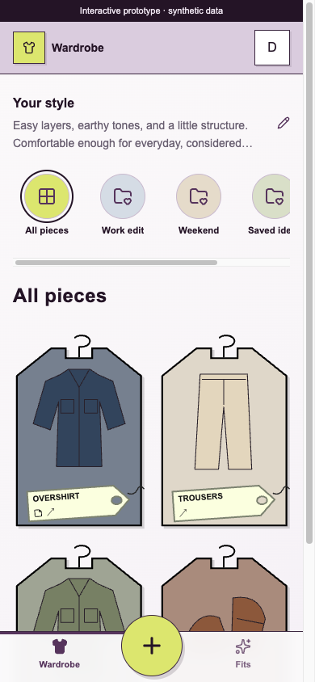
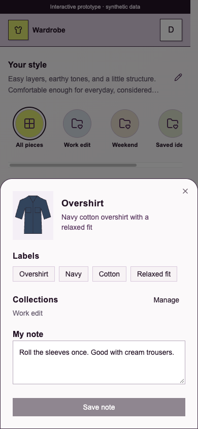
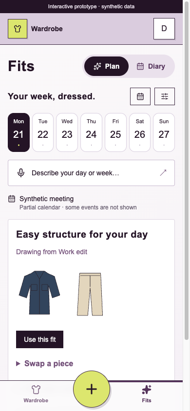

# Wardrobe collections and near-term Plan prototype

Review hold: this branch is a draft prototype. Keep its PR in draft with `do-not-merge` until David reviews the interactions and explicitly releases the hold. Do not deploy or enable auto-merge as part of this prototype.

This follows the September 21 design review and [product program #60](https://github.com/schmitd/wardrobe/issues/60). It supersedes the earlier use of “Plans” for moodboards on the web; existing saved collection records are retained.

## Review the interaction

- Wardrobe begins with compact editable style notes, then a horizontal collection rail. Collections have immediate Pieces and Inspiration views and an Add from wardrobe picker.
- The entire shirt-shaped card opens its drawer. Labels, Collections, and My note are distinct; Manage changes membership and Save note persists the personal note. Tags carry category, note, and selected-collection cues.
- Fits opens with Plan / Diary. Plan shows today plus six days, a description/dictation entry, nearby calendar context, and one selected outfit. The global Add action serves capture; duplicate upload cards are removed.
- Relevant collections are recalled automatically when generating a reviewed day or week. Already planned/worn outfits remain protected. Past planned outfits can still be corrected from Diary.

| Wardrobe | Item drawer | Plan |
| --- | --- | --- |
|  |  |  |

[Desktop Wardrobe](wardrobe-desktop.png)

Screenshots and the standalone gallery use synthetic garment illustrations, account data, and calendar events. The gallery renders the real components and stylesheet; external auth, storage, provider calls, and persistence boundaries are simulated. The application uses authenticated Convex functions, not gallery state.

## Run locally

```sh
bun install --frozen-lockfile
PROBE_PORT=4181 bun run apps/web/validation/browser/server.ts
```

Open `http://127.0.0.1:4181/` for Wardrobe and `/fits` for Plan / Diary. The synthetic gallery resets its data on full navigation; mutations persist within the current browser journey. No production credentials are needed.

```sh
PLAYWRIGHT_CHANNEL=chrome bun run probe:browser --plan docs/validation/collections-prototype.json --output output/playwright/collections-flow --port 4183
PLAYWRIGHT_CHANNEL=chrome bun run validate browser
bun test apps/web/confect/collections.integration.test.ts packages/shared/src/collection-context.test.ts
```

Omit `PLAYWRIGHT_CHANNEL=chrome` when using Playwright's installed Chromium, as CI does.

## Prototype boundaries for review

- This is the responsive web implementation. Native navigation and binaries are unchanged; existing native API fields remain compatible.
- Automatic collection recall uses bounded word/activity matching over up to 100 collections and recalls at most three. It includes owned collection pieces outside the recent inventory window and item notes in the generation prompt. Broader semantic recall and ranking quality need real usage review.
- Item notes are limited to 2,000 characters; up to 500 characters per item inform week generation. Collection membership in an item drawer is capped at 100 with an explicit truncation message; collection and owned-piece browsing are paginated.
- Live Clerk/Gemini/Google Calendar delivery and a production Convex deployment were not exercised. Backend ownership, projection, note persistence, and older-piece recall are covered by Convex integration tests.

## Verification

- Full repository tests, lint, type checking, and production builds.
- Existing browser journeys cover past-outfit corrections, saved-but-stale feedback, multilingual week review, partial-calendar disclosure, and delayed try-on capture.
- The 29-step collection probe covers full-card opening, labels, saving a note, Escape, collection creation, adding existing pieces, switching to inspiration, and removing membership.
- Browser layout checks at 320, 390, 767, 768, and 1280 pixels found no horizontal document/card overflow. At 390 × 844, the selected outfit's Use this fit action is visible above the bottom navigation.
